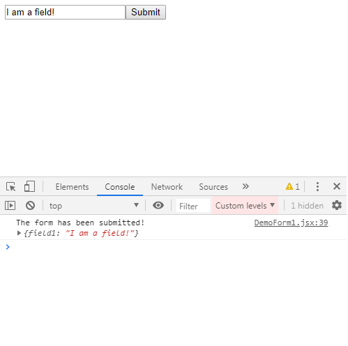
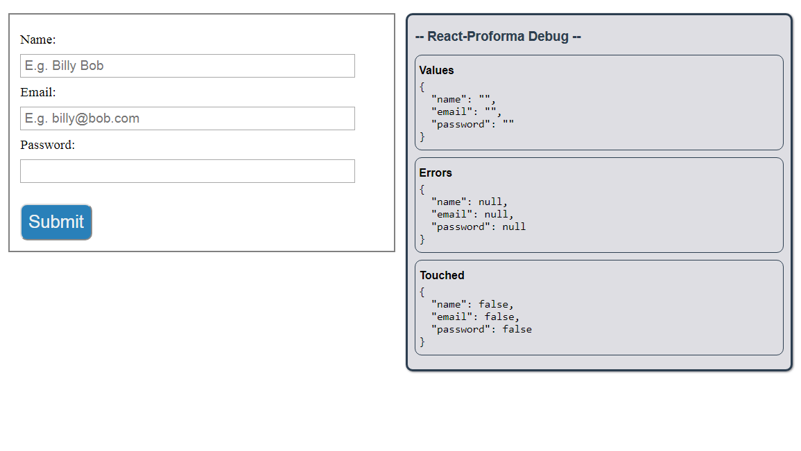
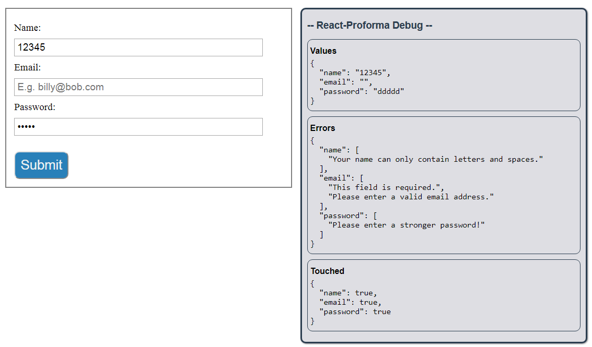
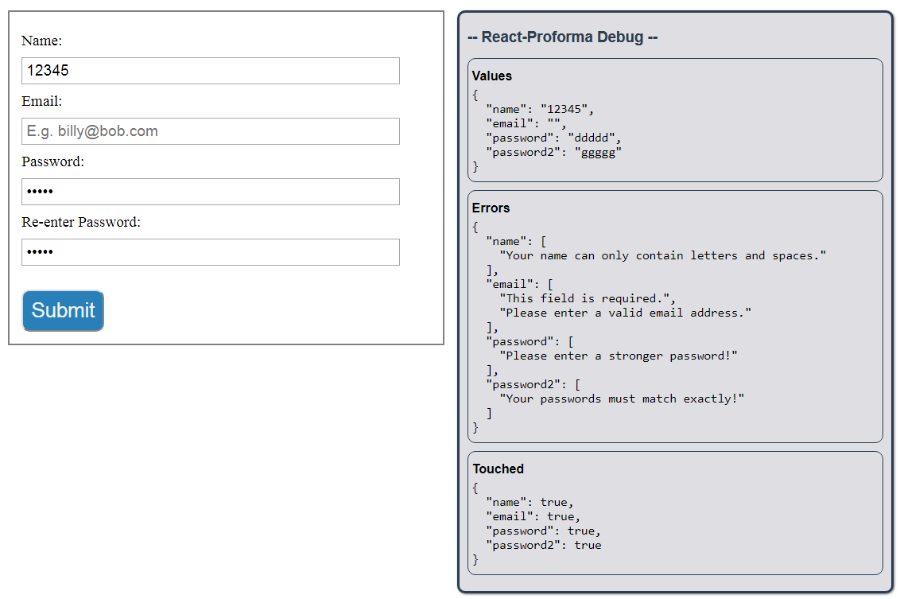
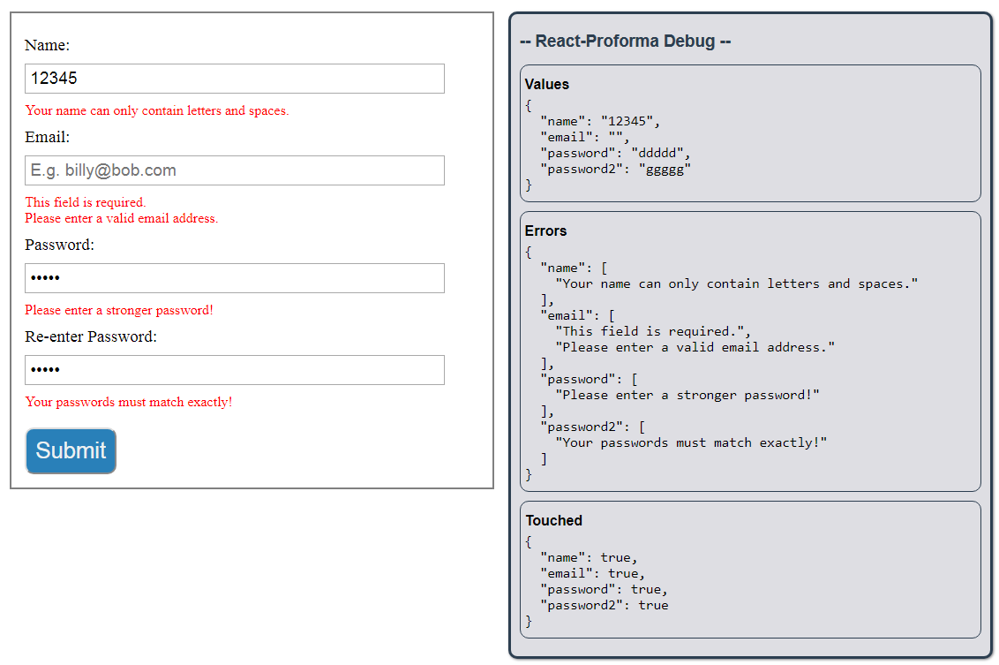

# React Proforma <!-- omit in toc -->

### React Proforma helps you build simple to complex forms with ease in React for the web. <!-- omit in toc -->

> **Simplicity where you want it. Flexibility where you need it.**

Easily manage multiple form fields, validation, focus handling, and form submission. Use custom components (styled with css-in-js or from a UI library) or standard react elements anywhere you like. React Proforma is a complete form-solution that will make building your next React web form a breeze!

---

# Table of Contents <!-- omit in toc -->

- [Installation](#installation)
- [Basic Usage](#basic-usage)
  - [Step 1: Build the basic scaffolding:](#step-1-build-the-basic-scaffolding)
  - [Step 2: Add `config` and `handleSubmit` props to the `Proforma` component](#step-2-add-config-and-handlesubmit-props-to-the-proforma-component)
  - [Step 3: Fill in `renderForm`](#step-3-fill-in-renderform)
- [Normal Usage](#normal-usage)
  - [Form Skeleton](#form-skeleton)
  - [Validation](#validation)
    - [Enter the `validationObject`.](#enter-the-validationobject)
  - [Cross-Field Validation](#cross-field-validation)
  - [Displaying Errors](#displaying-errors)
    - [Enter `fieldError()`](#enter-fielderror)

---

## Installation

Install using npm:

`npm install react-proforma`

---

## Basic Usage

We'll start by building up a very basic, no-frills example with a single field and a submit button, just to give you a feel for what's going on. After that, I'll demonstrate code that is more like what you would normally use, including using React Proforma's custom form elements that are all hooked up internally.

> - I prefer using class components because I find they better organize my code. You are, of course, free to use function components.
> - **_All exports are named exports_**, so don't forget your curly brackets on your import statements!

### Step 1: Build the basic scaffolding:

```javascript
import React from 'react';
import { Proforma } from 'react-proforma';

class DemoForm1 extends React.Component {
  renderForm(proformaBundle) {}

  render() {
    return <Proforma>{this.renderForm}</Proforma>;
  }
}
```

- Notice how the component's `render` method is returning the `Proforma` component, and inside that is a reference to a function that I've called `renderForm`.
- The sole argument passed to `renderForm` is the bundle of methods and properties you will need for your form to function. I've assigned this argument the name `proformaBundle`.
- Please note that **there are no parentheses** next to `this.renderForm`! This is a function reference, not a function invocation.

### Step 2: Add `config` and `handleSubmit` props to the `Proforma` component

```javascript
import React from 'react';
import { Proforma } from 'react-proforma';

class DemoForm1 extends React.Component {
  renderForm(proformaBundle) {}

  render() {
    return (
      <Proforma
        config={{
          initialValues: {
            field1: ''
          }
        }}
        handleSubmit={(values) => {
          console.log('The form has been submitted!', values);
        }}
      >
        {this.renderForm}
      </Proforma>
    );
  }
}
```

- `Proforma.config` accepts an object (note the double curly braces) with one required property (`initialValues`) and a few optional properties (we'll learn more about those later).
  - `initialValues` is a required property, whose value must be an object, whose properties must correspond with the names of your form fields (i.e. name, email, password, etc.), and whose values are the initial value you'd like to set for each respective form field.
  - In this example, I have a single field name (`field1`), and I've set it to have an initial value of `''` (empty string).
  - Please note that form field values in React and HTML can only be boolean (for checkboxes) or strings. So if you pass in any other type of value to `initialValues`, it will be ignored, and empty string `''` will be used.
- `Proforma.handleSubmit` is any function you want to have executed when the form is submitted. [See the api](#proforma.handleSubmit) for details, including what arguments are passed to your `handleSubmit` function on execution.
- There will be nothing on your screen because `renderForm` isn't returning anything. Let's fix that next.

### Step 3: Fill in `renderForm`

```javascript
import React from 'react';
import { Proforma } from 'react-proforma';

class DemoForm1 extends React.Component {
  renderForm(proformaBundle) {
    const {
      values,
      handleSubmit,
      handleChange,
      handleFocus,
      handleBlur
    } = proformaBundle;

    return (
      <form onSubmit={handleSubmit}>
        <input
          type="text"
          name="field1"
          value={values.field1}
          onChange={handleChange}
          onFocus={handleFocus}
          onBlur={handleBlur}
        />
        <button type="submit">Submit</button>
      </form>
    );
  }

  render() {
    return (
      <Proforma
        config={{
          initialValues: {
            field1: ''
          }
        }}
        handleSubmit={(values) => {
          console.log('The form has been submitted!', values);
        }}
      >
        {this.renderForm}
      </Proforma>
    );
  }
}
```

> I know this looks ugly, but React Proforma's custom form elements will clean this all up very quickly! I just wanted to show you the manual set up first.

- We begin by destructuring out `values`, `handleSubmit`, `handleChange`, `handleFocus`, and `handleBlur` from `proformaBundle`.
  - I will be using the more conventional destructuring-in-place later on whenever I need anything from `proformaBundle`. [See the docs](#proformaBundle) for a full breakdown of all the properties and methods you can access from inside `proformaBundle`.
- `renderForm` then returns a regular React form component.
- I manually assign the various handlers to their respective event hooks in the `form` and `input` elements, set the `name` prop on the `input` element to be 'field1', and hook up the `value` prop of the input to `values.field1`.

At this point, we have a fully functioning form. The input is completely controlled, and you can submit the form by clicking the submit button (your console should display the message "The form has been submitted!", followed by the form values).



---

## Normal Usage

Now that you've seen the nuts and bolts, let's clean it up and create a more complete example, with multiple fields (and types of fields), validation, and custom components.

### Form Skeleton

We'll create a sign-up form with name, email address, and password fields to start.

```javascript
import React from 'react';
import './DemoForm2.css';
import { Proforma, Form, Field, Submit, Debug } from 'react-proforma';

class DemoForm2 extends React.Component {
  renderForm() {
    return (
      <div className="outer-wrapper">
        <div className="form-wrapper">
          <Form>
            <div className="field-row">
              <label htmlFor="name-field">Name:</label>
              <Field
                name="name"
                type="text"
                className="form-field"
                id="name-field"
                placeholder="E.g. Billy Bob"
              />
            </div>
            <div className="field-row">
              <label htmlFor="email-field">Email:</label>
              <Field
                name="email"
                type="text"
                className="form-field"
                id="email-field"
                placeholder="E.g. billy@bob.com"
              />
            </div>
            <div className="field-row">
              <label htmlFor="password-field">Password:</label>
              <Field
                name="password"
                type="password"
                className="form-field"
                id="password-field"
              />
            </div>
            <Submit className="submit-button" />
          </Form>
        </div>
        <div className="debug-wrapper">
          {/* DEBUG COMPONENT */}
          <Debug />
        </div>
      </div>
    );
  }

  render() {
    return (
      <Proforma
        config={{
          initialValues: {
            name: '',
            email: '',
            password: ''
          }
        }}
        handleSubmit={(values) => {
          console.log('The form has been submitted!', values);
        }}
      >
        {this.renderForm}
      </Proforma>
    );
  }
}
```
With some styling divs here and there, this code produces the following form:
> [Grab the css file](demo/DemoForm2.css) if you want to follow along exactly.



> NOTE: That window you see on the right is a `Debug` component I made in case you ever want to see the current internal Proforma state. Just `import { Debug } from 'react-proforma'` and insert the component anywhere.

The styling divs clutter things up a little, but I want you to just focus on the props passed to the `Proforma` component, as well as the `Form` element inside the `renderForm` method.

- **Proforma props**
  - Again we have our `config` prop. Inside `config` is an object with a single property (for now) called 'initialValues', which contains the names of all the form fields our form is going to have, and their respective initial values.
  - Our `handleSubmit` is again going to just console log our values.
- **Looking inside `renderForm`**
  - Here is our first exposure to the `Form`, `Field`, and `Submit` components imported from React Proforma.
  - Using these components, you no longer have to wire up your form functionality manually -- these components are all hooked up for you.
  - All you have to do is pass in a `name` (that corresponds with one of the keys on your `initialValues` object) and a `type` (defaults to "text") as props, along with whatever other props you'd want passed down to the input element that will be returned (e.g. id, className, style, placeholder, maxLength, etc.)

Alright, so everything looks good, but we're going to need some **validation**.

Thankfully, React Proforma makes that almost comically easy!

### Validation

#### Enter the `validationObject`.

First, let's do it the long way:

```javascript
<Proforma
  config={{
    initialValues: {
      name: '',
      email: '',
      password: ''
    },
    validationObject: {
      name: (values) => {
        const { name } = values;
        const errors = []
        if (name.length === 0) {
          errors.push('This field is required.');
        }
        if (!/^[a-zA-Z\s]*$/.test(name)) {
          errors.push('Your name can only contain letters and spaces.');
        }
        if (errors.length > 0) return errors;
        return null;
      }
    }
  }}
  handleSubmit={(values) => {
    console.log('The form has been submitted!', values);
  }}
>
  {this.renderForm}
</Proforma>
```
So what's going on here.

- `validationObject` is another property on the object passed to the `config` prop. Here, the keys are one of the form field names (I used the 'name' form field here), and the values are a function which accepts **all** of the current form values, and returns either an array of strings or null.
- In this example, I destructure the 'name' value from `values`, set up an empty errors array, and then run two validation tests on 'name':
  1. Make sure the length of 'name' is not zero (i.e. this field is required)
  2. Make sure 'name' contains only letters and spaces (with a regex test)
- If either of these produce an error, an error message is pushed into the errors array.
- Finally, if there are any errors in the errors array, the errors array is returned. Otherwise, `null` is returned.

So, obviously this is a lot of typing. This is why I created a field validation helper called `fieldValidator`. Simpy `import { fieldValidator } from 'react-proforma'`, and use it to produce the same result as above:

```javascript
validationObject: {
  name: (values) => {
    return fieldValidator(values.name)
      .required()
      .regex(
        /^[a-zA-Z\s]*$/,
        'Your name can only contain letters and spaces.'
      )
      .end();
  }
}
```
- Inside the function, pass `fieldValidator` the value you want to validated (in this case, it's "values\.name"), and then chain on whatever validations you want. 
- Here, I've used `.required()` and `.regex()`.
- All validator methods have default error messages, but you can optionally use your own, as I did here with the `regex()` call.
- [See the `fieldValidator` docs](#fieldValidator) for all of the methods available to you.

> NOTE: You must add `.end()` to the end of the `fieldValidator` chain, and return the entire chain from the function! (I.e. `return fieldValidator(values.name) ..... .end()`)

With this new tool, let's go ahead and add email and password validation in just a few seconds:

```javascript
validationObject: {
  name: (values) => {
    return fieldValidator(values.name)
      .required()
      .regex(
        /^[a-zA-Z\s]*$/,
        'Your name can only contain letters and spaces.'
      )
      .end();
  },
  email: (values) => {
    return fieldValidator(values.email)
      .required()
      .email()
      .end();
  },
  password: (values) => {
    return fieldValidator(values.password)
      .required()
      .regex(
        /^(?=.*[a-z])(?=.*[A-Z])(?=.*[0-9])(?=.{8,})/,
        'Please enter a stronger password!'
      )
      .end();
  }
}
```
> NOTE: I pass the entire values object to each validation field so that you can access other values if that's what your validation requires. For more information, [see the `fieldValidator` docs](#fieldValidator).

Now we can take our form for a spin. Enter valid and invalid values, and see the 'Errors' object update in the `Debug` display.

For example:


>NOTE: The 'Touched' value for each field name turns `true` when a field recieves and then loses focus. This is useful for displaying errors to the user, which is typically done only if 'touched' is `true` for that field name.

So this is all working quite nicely. But let's go ahead and try something a little more challenging, and see how React Proforma performs.

### Cross-Field Validation

Let's say at this point we decide to add a second password field. That means we have to add a new field to our form, as well as attempt cross-field validation. Once again, React Proforma makes it all easy.

Let's start by updating our form.

Add the following to your `Form` inside `renderForm`, before the `Submit` button:

```javascript
<div className="field-row">
  <label htmlFor="password2-field">Re-enter Password:</label>
  <Field
    name="password2"
    type="password"
    className="form-field"
    id="password2-field"
  />
</div>
```
> NOTE: the '**name**' I used for this new field is '**password2**'.

And update your `initialValues` object:

```javascript
initialValues: {
  name: '',
  email: '',
  password: '',
  password2: ''
}
```
> REMINDER: All form field names must be present in the `initialValues` object, or it won't be included in any of React Proforma's functionality.

Now we need to add validation to 'password2' to make sure it matches, 'password'.

Watch this.

Add the following property to your `validationObject`:

```javascript
password2: (values) => {
  return fieldValidator(values.password2)
    .required()
    .custom(values, (values) => {
      if (values.password2 !== values.password) {
        return 'Your passwords must match exactly!';
      }
    })
    .end();
}
```

Here we are making use of the `custom()` method chained to `fieldValidator()`. `custom()` takes two arguments:
1. `values` - just passing in the values object from the outer function
2. A function you create which accepts that same values object as a parameter, runs any checks you want, and then returns a string value (or undefined).

And that's all it takes to perform cross-field validation. With `.custom()`, you can reference any value from any field name to perform your validation.

Here's what we've created so far:



### Displaying Errors

The normal way of displaying errors in React is to write up some conditional checks inside your jsx that looks something like:

```javascript
<div>
  {touched.email && errors.email &&
    errors.email.map((error) => ...) /* return component that displays error */
  }
</div>
```
But that's kind of ridiculous to have to do for every single form field.

#### Enter `fieldError()`

Use it like this:

1. `import { fieldError } from 'react-proforma'`
2. Create a component that will recieve each individual error message as it's only prop. For example:
```javascript
function FieldError(props) {
  return <p className="field-error">{props.error}</p>;
}
```
3. Under each field row, add the following:
```javascript
{fieldError('<FIELD NAME>', FieldError)}
```
As in:
```javascript
<div className="field-row">
  <label htmlFor="name-field">Name:</label>
  <Field
    name="name"
    type="text"
    className="form-field"
    id="name-field"
    placeholder="E.g. Billy Bob"
  />
</div>
{fieldError('name', FieldError)} /* <--- */
```
>You could put `fieldError()` anywhere of course.

And just like that we have:

